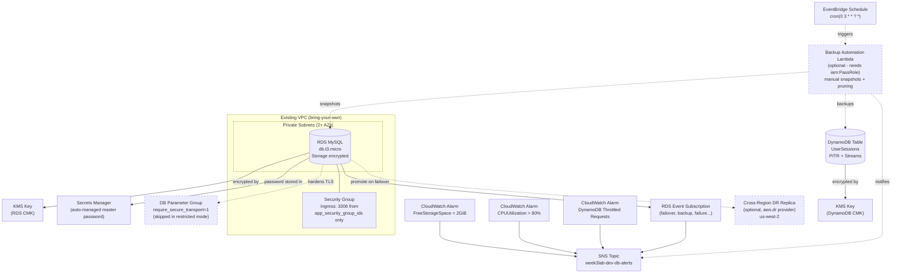

# Week 3 — Architecture Diagram

**Key points:**
- **Solid lines** = always deployed; **dashed lines/boxes** = optional, gated by variables (`enable_backup_automation`, `enable_cross_region_dr`, and the parameter group which is skipped under `restricted_permissions`).
- Both RDS and DynamoDB get dedicated KMS keys (not the AWS-managed default), and the RDS master password is never in Terraform state — it's auto-generated and stored in Secrets Manager.
- All alarms/events funnel into a single shared SNS topic, which is what the (optional) backup Lambda also publishes success/failure notifications to.
- The DR replica uses a second aliased provider (`aws.dr`) pointed at a different region, only created when explicitly enabled.
